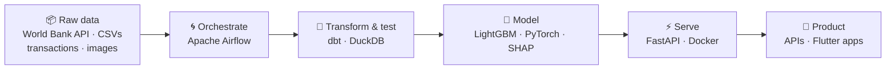

<p align="center">
  
</p>

<p align="center">
  
</p>

<p align="center">
  <a href="https://portfolio-igd.vercel.app/"></a>
  <a href="https://linkedin.com/in/ibrahima-gabar-d/"></a>
  <a href="https://kaggle.com/ibrahimagabardiop"></a>
  <a href="mailto:ibrahimagabardiop98@gmail.com"></a>
  
  
</p>

> **Data Engineer at [Rubyx](https://www.rubyx.io)**, working on lending analytics for financial institutions. On this profile you'll find what I build around one theme I care about: **data & AI for financial inclusion in Africa** 🌍

---

## 🗺️ This profile reads like a data pipeline

Every repo below is a real, working stage of the same story — from raw data to a decision in production:



---

## ⭐ Flagship projects

| Project | The story | Stack |
|---------|-----------|-------|
| ⚡ [**BNPL Risk Engine**](https://github.com/Gblack98/bnpl-risk-engine) | Real-time Buy-Now-Pay-Later risk scoring API — rule knockouts + LightGBM decisioning (**ROC-AUC 0.85**), fully tested & Dockerized | FastAPI · LightGBM · Docker |
| 🌍 [**West Africa Financial Inclusion**](https://github.com/Gblack98/west-africa-financial-inclusion) | Real-data ELT pipeline on financial inclusion across WAEMU countries: World Bank API → dbt → BigQuery → dashboard | Airflow · dbt · BigQuery |
| 🌾 [**GblackAI**](https://github.com/Gblack98/GblackAI-API) | AI crop pest & disease detection with **Wolof voice support**, built for AbiHack 2025 — [live API docs ↗](https://pestai-api.vercel.app/docs) | PyTorch · FastAPI · Flutter |

---

## 🌀 Orchestration — Apache Airflow

*Pipelines that run on schedule, recover from failure, and don't wake anyone up at 3am.*

| Repo | What it demonstrates |
|------|----------------------|
| [airflow-dynamic-dag-factory](https://github.com/Gblack98/airflow-dynamic-dag-factory) | YAML-driven DAG factory — config-as-code pipelines instead of DAG proliferation |
| [airflow-batch-credit-scoring](https://github.com/Gblack98/airflow-batch-credit-scoring) | Daily batch credit scoring: chunked dynamic mapping, versioned models, PSI drift gate |
| [airflow-dbt-cloud-orchestration](https://github.com/Gblack98/airflow-dbt-cloud-orchestration) | Full orchestration of dbt Cloud jobs — manifest parsing, quality gates, intelligent alerting |
| [airflow-cloud-data-platform](https://github.com/Gblack98/airflow-cloud-data-platform) | Production patterns: dynamic task mapping, Kubernetes, custom XCom backend, cost optimization |

---

## 🧱 Analytics Engineering — dbt

*Because a metric nobody trusts is a metric nobody uses.*

| Repo | What it demonstrates |
|------|----------------------|
| [dbt-advanced-patterns](https://github.com/Gblack98/dbt-advanced-patterns) | Incremental models, SCD Type 2, custom macros, slim CI — for fintech data platforms |
| [dbt-testing-and-data-quality](https://github.com/Gblack98/dbt-testing-and-data-quality) | Testing framework with custom macros, automated data-quality monitoring, CI quality gates |
| [credit-scoring-dbt](https://github.com/Gblack98/credit-scoring-dbt) | Raw fintech transactions → ML-ready credit features, engineered in dbt |
| [digital-lending-analytics-dbt](https://github.com/Gblack98/digital-lending-analytics-dbt) | Data warehouse & BI for digital lending — loan portfolio KPIs and cohort analysis |

---

## 🤖 Machine Learning — credit risk & fraud

*Applied to the problems fintech actually has.*

| Repo | What it demonstrates |
|------|----------------------|
| [msme-alternative-credit-scoring](https://github.com/Gblack98/msme-alternative-credit-scoring) | Alternative credit scoring for African MSMEs from mobile-money & behavioral data |
| [aml-graph-neural-network](https://github.com/Gblack98/aml-graph-neural-network) | Anti-money-laundering detection with Graph Neural Networks (GraphSAGE) |
| [fraud-detection-deep-learning](https://github.com/Gblack98/fraud-detection-deep-learning) | Credit-card fraud detection: autoencoder + LightGBM, explained with SHAP |
| [financial-nlp-news-market](https://github.com/Gblack98/financial-nlp-news-market) | Financial news sentiment → market prediction, with FinBERT & LSTM |
| [loan-default-ml-pipeline](https://github.com/Gblack98/loan-default-ml-pipeline) | End-to-end loan-default prediction pipeline with SHAP explainability |

---

## 👤 About me, as a dbt model

```yaml
version: 2

models:
  - name: ibrahima_gabar_diop
    description: "AI & Data Developer — Thiès, Senegal 🇸🇳"
    meta:
      current_role: "Data Engineer @ Rubyx"
      education:
        - "MSc Big Data Analytics · UNCHK (in progress)"
        - "BSc Mathematics & Computer Science"
        - "Sonatel Academy alumnus"
      competitions: [Zindi, Kaggle, GalsenAI, Devpost]
      happy_to_talk_about: [data engineering, LLMs, computer vision]
    columns:
      - name: curiosity
        description: "How things work under the hood"
        tests:
          - not_null
```

## 🛠️ Tech Stack

**Data & Analytics** &nbsp;


**AI / ML** &nbsp;


**Backend & Infra** &nbsp;


**Frontend & Mobile** &nbsp;


## 📊 GitHub Stats

<p align="center">
  
  
</p>

---

<p align="center">
  
</p>

<p align="center">
  
</p>
